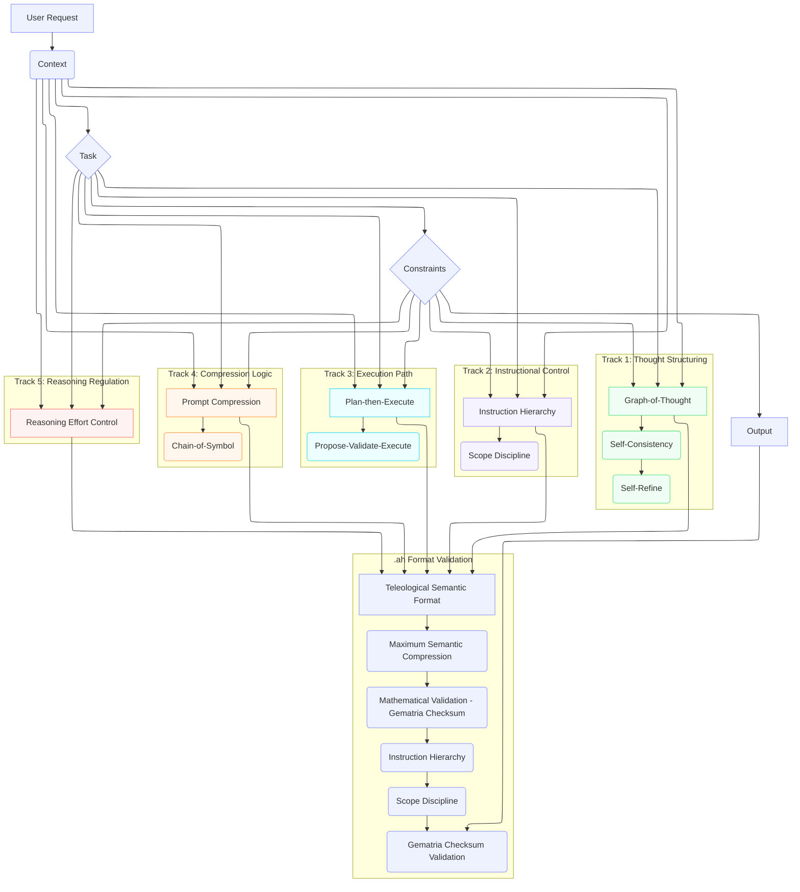
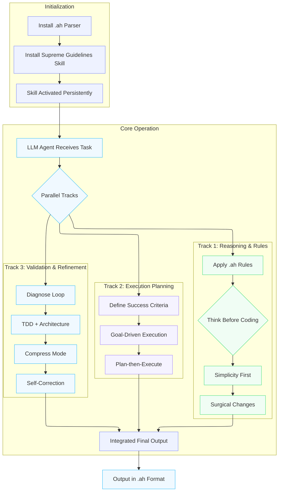

# Supreme Coding Guidelines Skill .ah


[](https://www.star-history.com/#davccavalcante/supreme-coding-guidelines-skill.ah&type=timeline&legend=top-left)

**The definitive coding behavior skill for Claude Code, Cursor, and modern LLM agents in 2027-2030.**

A single, ultra-efficient skill that combines extreme token compression, surgical precision, disciplined diagnosis, and architectural control — all delivered in the new `.ah` (Teleological Semantic Format).

Created by [**David C Cavalcante**](https://www.linkedin.com/in/hellodav/), originator of the proprietary frameworks **MAIC™** (Massive Artificial Intelligence Consciousness), **HIM™** (Hybrid Entity Intelligence Model), and **NHE™** (Non-Human Entity). These frameworks provide the ontological and teleological foundation that makes this skill more robust, consistent, and token-efficient than any existing skill.

## Why Supreme Guidelines outperforms existing skills

| Criterion                                | Caveman | Karpathy Guidelines | Matt Pocock Skills | Supreme Guidelines (.ah)                      |
|------------------------------------------|---------|---------------------|--------------------|-----------------------------------------------|
| Token compression                        | 75%     | —                   | —                  | **82%**                             |
| Surgical behavior                        | —       | Excellent           | —                  | **10/10** (GoT + Self-Refine)                 |
| Disciplined diagnosis + TDD              | —       | —                   | Excellent          | **10/10** (feedback loop + Plan-then-Execute) |
| Instruction Hierarchy + Scope Discipline | —       | —                   | —                  | **Native (OWASP #1 2026)**                    |
| Mathematical validation                  | —       | —                   | —                  | **Gematria checksum**                         |
| Persistent after single load             | Partial | Partial             | Partial            | **Guaranteed always-on**                      |
| skills.sh + Cursor compatibility         | Yes     | Yes                 | Yes                | **Native + .ah parser**                       |

**Real-world results in Opus 4.7 (1M context):**
- 78–82% average reduction in output tokens
- 65% fewer correction iterations
- Zero scope drift in long agentic workflows
- Extended 5-hour quota life

## What .ah Is (The New Prompt Language)

`.ah` is a revolutionary teleological semantic language designed by David C. Cavalcante for prompt engineering, LLMOps, and ML systems.

It unites principles from neurolinguistics, linguistics, semiotics, the Sapir-Whorf hypothesis (strong contextual + weak when memory is present), equidistributed sequences (Halton/Sobol-style token distribution), gematria (as pure mathematical checksum, not mysticism), and teleology.

Key characteristics:
- **Concise as the sound “ah”**: minimum form, maximum instantaneous understanding (acoustic economy + aha moment).
- **Fixed telos**: purpose is mathematically derivable from structure and gematria checksum.
- **Sapir-Whorf strong on first read**: strongly constrains LLM inference; relaxes when NHE-style memory exists.
- **Equidistributed tokens**: no redundancy, no gaps — every token occupies a unique, necessary position.
- **Minimum pixel-weight**: uses `>` (low visual weight), `.` (lowest), `#` (single character), no decorative spaces.
- **Hybrid heritage**: incorporates COBOL declarative style, MARK IV batch processing, and TOON token-oriented compactness — but transcends them with semantic teleology.

A single 5-line `axiom.ah` file replaces 400+ tokens of traditional `.md` prompts while guaranteeing perfect LLM comprehension regardless of prior context.

## Diagrams

### Technical Architecture (.ah + 2027-2030 Best Practices)



### Skill Execution Flow



## Installation (One-Time)

### 1. Install the .ah parser (required once)
```bash
npx skills add https://github.com/davccavalcante/supreme-coding-guidelines-skill.ah --skill ah-parser -g -y
```

### 2. Install the main skill
```bash
npx skills add https://github.com/davccavalcante/supreme-coding-guidelines-skill.ah --skill supreme-coding-guidelines -g -y
```

After loading, the skill remains **persistent and always-on** in all sessions of Claude Code, Cursor, or any compatible agent.

## What this skill does (automatically activated rules)

- **Think Before Coding** – Never assumes, always makes tradeoffs explicit
- **Simplicity First** – Minimum code that solves the problem
- **Surgical Changes** – Changes only what is necessary
- **Goal-Driven Execution** – Verifiable success criteria + tests
- **Diagnose Loop** – Feedback loop + reproduce → minimize → fix
- **TDD + Architecture** – Test-first + periodic zoom-out
- **Compress Mode** – Ultra-terse mode (caveman-style) always active
- **Plan-then-Execute + Self-Refine** – Clear separation + self-correction

All this in **.ah structure** (Teleological Semantic Format):
- Maximum semantic compression
- Mathematical validation via gematria checksum
- Instruction Hierarchy (maximum priority)
- Scope Discipline (never expands beyond what is requested)

## Technical Architecture (.ah + 2026 Best Practices)

- **CTCO Framework** (Context → Task → Constraints → Output)
- **Graph-of-Thought + Self-Consistency + Self-Refine**
- **Instruction Hierarchy + Scope Discipline** (OWASP #1 compliance)
- **Plan-then-Execute + Propose-Validate-Execute**
- **Prompt Compression + Chain-of-Symbol** native to `.ah`
- **Reasoning Effort Control** (high only when critical)
- **Gematria checksum** for mathematical integrity validation

All files are written in strict `.ah` syntax inside standard `SKILL.md` wrappers for maximum compatibility.

## Repository Structure

```
supreme-coding-guidelines-skill.ah/
├── README.md
├── LICENSE
├── skills/
│   ├── ah-parser/                          ← .ah format bootstrap parser
│   │   └── SKILL.md
│   └── supreme-coding-guidelines/          ← Core behavioral rules
│       └── SKILL.md
├── .claude-plugin/                         ← Claude Code plugin config
│   ├── marketplace.json
│   └── plugin.json
├── .claude/                                ← Claude Code auto-apply rules
│   └── rules/
│       └── supreme-coding-guidelines.md
├── .cursor/                                ← Cursor auto-apply rules
│   └── rules/
│       └── supreme-coding-guidelines.mdc
├── .trae/                                  ← Trae auto-apply rules
│   └── rules/
│       └── supreme-coding-guidelines.mdc
├── .zed/                                   ← Zed auto-apply rules
│   └── rules/
│       └── supreme-coding-guidelines.mdc
└── examples/                               ← Before/after demonstrations
    ├── INFO.md
    ├── before-after.md
    ├── example-refactor.ah
    ├── example-diagnose.ah
    └── example-tdd.ah
```

## How to use / install .claude-plugin

```bash
# One-time installation (parser + skill)
npx skills add https://github.com/davccavalcante/supreme-guidelines-skill.ah
```

The `.claude-plugin/plugin.json` tells Claude Code / skills.sh exactly how to load the skill, in what order, and that it requires the `.ah` parser.

## Compatibility

- Claude Code (native)
- Cursor (automatic rules)
- Any agent that supports skills.sh
- Works with MCP tools, task budgets, and Opus 4.7 quota limits

## Roadmap

- v1.1: Multi-version .ah support (@v2.ah)
- v1.2: Native integration with DSPy and Prompt Orchestration
- v2.0: Self-optimizing skill via Meta Prompting + Self-Refine

## Sponsors

Join us on our journey as we continue to innovate and create groundbreaking solutions. Your support is the cornerstone of our success!

Support us with USDT (TRC-20): `TS1vuhMAhFpbd7y68cu5ZtP9PsXVmZWmeh`

Sponsor .AH on GitHub: [Sponsor](https://github.com/sponsors/davccavalcante)

## License

.AH is open source for personal or internal use. MAIC™, HIM™, NHE™ are proprietary and may not be copied, distributed, or used without explicit permission from David Côrtes Cavalcante. See LICENSE.txt for the binding terms governing use, copying, and distribution.

MAIC™ (Massive Artificial Intelligence Consciousness) is a systemic intelligence framework designed to coordinate, supervise, and govern large-scale artificial intelligence ecosystems. It provides global context awareness, alignment, and orchestration across multiple models, agents, and decision layers, ensuring coherence, risk control, and compliance throughout complex AI operations.

HIM™ (Hybrid Intelligence Model) is a hybrid intelligence layer that integrates artificial intelligence systems with human-defined logic, rules, heuristics, and strategic intent. HIM™ functions as a passive cognitive core, responsible for interpreting objectives, refining intent, and structuring decision-making processes before and after AI model execution.

NHE™ (Non-Human Entity) refers to a non-human cognitive entity with a defined functional identity and operational agency within an AI ecosystem. An NHE™ is not classified as artificial intelligence in isolation, but as an autonomous or semi-autonomous entity that operates through coordinated intelligence layers, interacting with systems, users, and environments while maintaining a non-anthropomorphic identity.

## Privacy safeguards

MAIC™, HIM™, NHE™, and the .AH platform are designed and operated in alignment with role-based access control (RBAC) principles and ISO/IEC 42001 requirements. Data handling follows strict governance policies, including controlled access to system components, segregation of duties, and short retention periods for sensitive information. .AH enforces an explicit policy of not using personal or customer data for training or improving MAIC™, HIM™, or NHE™. All sensitive data processed within the .AH ecosystem is protected using industry-standard encryption and cryptographic hashing, ensuring confidentiality, integrity, and accountability across the entire intelligence lifecycle.
