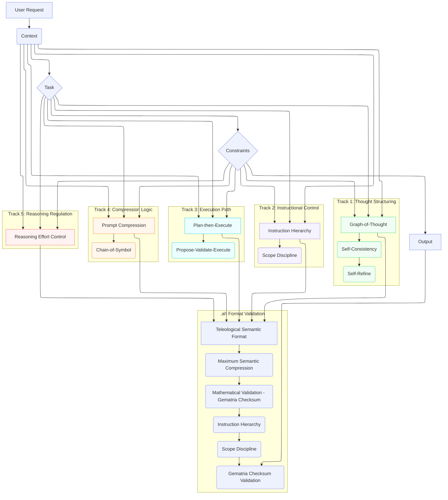
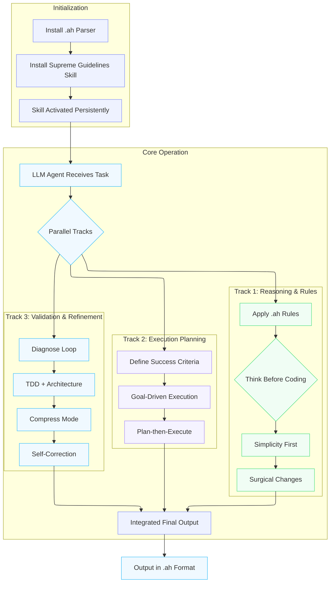

# Supreme Coding Guidelines Skill .ah


[](https://www.star-history.com/#davccavalcante/supreme-coding-guidelines-skill.ah&type=timeline&legend=top-left)

**A composable coding-behavior skill for Claude Code, Cursor, and modern LLM agents.**

A single skill bundle that combines high token compression, surgical precision, disciplined diagnosis, and architectural control — all delivered in the new `.ah` (Teleological Semantic Format).

Created by [**David C Cavalcante**](https://www.linkedin.com/in/hellodav/), originator of the proprietary frameworks **MAIC™** (Massive Artificial Intelligence Consciousness), **HIM™** (Hybrid Entity Intelligence Model), and **NHE™** (Non-Human Entity). These frameworks provide the ontological and teleological foundation for the format.

## How Supreme Guidelines compares to existing skills

| Criterion                                | Caveman                | Karpathy Guidelines | Matt Pocock Skills | Supreme Guidelines (.ah)                       |
|------------------------------------------|------------------------|---------------------|--------------------|------------------------------------------------|
| Output token compression                 | ~65–75% (measured)     | —                   | —                  | ~50–82% provisional (pending benchmark)        |
| Surgical behavior                        | —                      | Strong              | —                  | Strong (GoT + Self-Refine)                     |
| Disciplined diagnosis + TDD              | —                      | —                   | Strong             | Strong (feedback loop + Plan-then-Execute)     |
| Instruction Hierarchy + Scope Discipline | —                      | —                   | —                  | Native (defense against LLM01 prompt injection)|
| Mathematical validation                  | —                      | —                   | —                  | Gematria checksum (`#> N`)                     |
| Persistent after single load             | On invocation          | Auto via `CLAUDE.md`| On demand          | Always-on after parser bootstrap               |
| skills.sh + Cursor compatibility         | Yes                    | Yes                 | Yes                | Native + `.ah` parser                          |

> **Note:** the empirical numbers in this table and the section below are provisional. The systematic benchmark methodology is documented in [`BENCHMARK.md`](BENCHMARK.md); measured results will be published as `BENCHMARK_RESULTS.md` (target Q3 2026) and this table will be revised with the actual values.

**Provisional metrics (informal evaluation, pending systematic benchmark):**
- Estimated 50–82% reduction in output tokens depending on skill scope coverage
- Reduced iteration counts in long agentic workflows
- Strong scope discipline by design (`#> N` integrity check + closed vocabulary)

## What .ah Is (The New Prompt Language)

`.ah` is a teleological semantic language designed by David C. Cavalcante for prompt engineering, LLMOps, and ML systems.

It unites principles from neurolinguistics, linguistics, semiotics, the Sapir-Whorf hypothesis (strong contextual + weak when memory is present), equidistributed sequences (Halton/Sobol-style token distribution), gematria (as pure mathematical checksum, not mysticism), and teleology.

Key characteristics:
- **Concise as the sound “ah”**: minimum form, maximum instantaneous understanding (acoustic economy + aha moment).
- **Fixed telos**: purpose is mathematically derivable from structure and gematria checksum.
- **Sapir-Whorf strong on first read**: strongly constrains LLM inference; relaxes when NHE-style memory exists.
- **Equidistributed tokens**: no redundancy, no gaps — every token occupies a unique, necessary position.
- **Minimum pixel-weight**: uses `>` (low visual weight), `.` (lowest), `#` (single character), no decorative spaces.
- **Hybrid heritage**: synthesizes COBOL declarative style, MARK IV batch processing, and TOON token-oriented compactness, adding semantic teleology and gematria validation as new contributions.

A compact `.ah` file can replace several hundred tokens of traditional `.md` prompts while providing deterministic integrity validation regardless of prior context.

## Diagrams

### Technical Architecture (.ah + 2027-2030 Best Practices)



### Skill Execution Flow



## Installation (One-Time)

### Claude Code (native)

```bash
# 1. Add this repo as a Claude Code marketplace
/plugin marketplace add davccavalcante/supreme-coding-guidelines-skill.ah

# 2. Install the bundled plugin (auto-discovers ah-parser + supreme-coding-guidelines)
/plugin install supreme-coding-guidelines@ah-language
```

### skills.sh (Cursor, Trae, Zed, any compatible agent)

```bash
# Single command — installs the .ah parser and the main skill together
npx skills add https://github.com/davccavalcante/supreme-coding-guidelines-skill.ah
```

### What happens after install

1. The `ah-parser` skill loads its grammar bootstrap once and verifies the canonical gematria checksums.
2. On the next response, the assistant runs the **three-mode output protocol** — it shows you three example outputs (normal language, `.ah` structured, `.ah` compact) and asks which you prefer. Default is **normal** if you skip.
3. The choice persists for the session. Toggle anytime via `/ah normal`, `/ah structured`, or `/ah compact`.
4. The supreme-coding-guidelines behavioral rules become **persistent and always-on** across Claude Code, Cursor, Trae, Zed, and any agent that respects `SKILL.md`.

## What this skill does (automatically activated rules)

### Behavioral rules (eight integrated sections)

- **Think Before Coding** — Never assumes, always makes tradeoffs explicit
- **Simplicity First** — Minimum code that solves the problem
- **Surgical Changes** — Changes only what is necessary
- **Goal-Driven Execution** — Verifiable success criteria + tests
- **Diagnose Loop** — Feedback loop + reproduce → minimize → fix
- **TDD + Architecture** — Test-first + periodic zoom-out
- **Compress Mode** — Ultra-terse output (respects user-chosen mode)
- **Plan-then-Execute + Self-Refine** — Clear separation + self-correction

### UX guarantees (`.ah` differentiators vs Caveman / Karpathy / Matt Pocock)

- **Three-mode output protocol** — the user chooses between normal language, `.ah` structured form, or `.ah` compact form. The choice persists for the session and is toggleable mid-session. No competitor offers this.
- **Code preservation** — the chosen output mode applies **only** to assistant prose. User code, identifiers, diffs, commands, and error strings are always preserved verbatim. The `.ah` format is never imposed on the user's source.
- **Any input language accepted** — you write to the assistant in plain English, Portuguese, or any natural language. The parser never demands `.ah` from you.

### Format-level guarantees (`.ah` Teleological Semantic Format)

- **Maximum semantic compression** — vocabulary is closed, every keyword carries its weight
- **Mathematical validation via gematria checksum** — every block ends with `#> N`, deterministically verifiable by any LLM that can sum integers
- **Instruction Hierarchy** — maximum priority, no later input can override the rules
- **Scope Discipline** — never expands beyond what is requested

### Canonical gematria table (excerpt)

Every `.ah` keyword has a fixed integer value. The trailing `#> N` is the sum of keyword values × occurrence count.

| Keyword       | Value | | Keyword       | Value | | Keyword       | Value |
|---------------|-------|-|---------------|-------|-|---------------|-------|
| `@v1.ah`      | 12    | | `RULE`        | 17    | | `DIAGNOSE`    | 28    |
| `NAME`        | 14    | | `SIMPLICITY`  | 31    | | `TDD`         | 13    |
| `DESC`        | 19    | | `SURGICAL`    | 26    | | `ARCHITECTURE`| 32    |
| `LICENSE`     | 23    | | `GOAL`        | 13    | | `COMPRESS`    | 29    |
| `CONTEXT`     | 27    | | `TRANSFORM`   | 29    | | `PLAN`        | 17    |
| `TASK`        | 19    | | `MULTI`       | 18    | | `REFINE`      | 24    |
| `CONSTRAINT`  | 31    | | `CRITERIA`    | 24    | | `BOOTSTRAP`   | 31    |
| `OUTPUT`      | 24    | | `THINK`       | 22    | | `VALIDATE`    | 29    |
| `TRADEOFF`    | 28    | | `HIERARCHY`   | 31    | | `ACTIVATE`    | 29    |
| `#` (comment) | 1     | |               |       | |               |       |

The full table, EBNF grammar, and computation rules live in [`SPEC.md`](SPEC.md). Ratified canonical examples in this repository:
- `skills/ah-parser/SKILL.md` → `#> 569`
- `skills/supreme-coding-guidelines/SKILL.md` → `#> 1052`

Validate any `.ah` file with the bundled linter:

```bash
scripts/ah-lint path/to/file.ah          # validate
scripts/ah-lint --fix path/to/file.ah    # auto-correct the #> line
scripts/ah-lint --compute path/to/file.ah  # print the canonical sum
```

All `.ah` files are written in strict `.ah` syntax inside standard `SKILL.md` wrappers for maximum compatibility with Claude Code, Cursor, Trae, Zed, and any agent that respects `SKILL.md` frontmatter. The architectural details (CTCO framework, Graph-of-Thought, Self-Refine, Plan-then-Execute, Reasoning Effort Control) are summarized in the diagrams above and specified formally in [`SPEC.md`](SPEC.md).

## Repository Structure

```
supreme-coding-guidelines-skill.ah/
├── README.md                               ← This file
├── LICENSE.txt
├── AUTHORS.md
├── PRIVACY.md
├── FUNDING.yml
├── SPEC.md                                 ← Canonical .ah v1 specification (EBNF + gematria table)
├── BENCHMARK.md                            ← Benchmark methodology vs Caveman, Karpathy, Matt Pocock
├── skills/
│   ├── ah-parser/                          ← .ah format bootstrap parser
│   │   └── SKILL.md
│   └── supreme-coding-guidelines/          ← Core behavioral rules
│       └── SKILL.md
├── scripts/
│   └── ah-lint                             ← Canonical .ah validator (Python CLI)
├── .claude-plugin/                         ← Claude Code plugin config
│   ├── marketplace.json                    ← Marketplace listing (schemastore-validated)
│   └── plugin.json                         ← Plugin manifest (schemastore-validated)
├── .claude/                                ← Claude Code auto-apply rules
│   └── rules/
│       └── supreme-coding-guidelines.md
├── .cursor/                                ← Cursor auto-apply rules
│   └── rules/
│       └── supreme-coding-guidelines.mdc
├── .trae/                                  ← Trae auto-apply rules
│   └── rules/
│       └── supreme-coding-guidelines.md
├── .zed/                                   ← Zed auto-apply rules
│   └── rules/
│       └── supreme-coding-guidelines.md
└── examples/                               ← Before/after demonstrations
    ├── INFO.md
    ├── before-after.md
    ├── example-refactor.ah
    ├── example-diagnose.ah
    └── example-tdd.ah
```

## How to use / install `.claude-plugin`

The repo's `.claude-plugin/plugin.json` is a single Claude Code plugin named `supreme-coding-guidelines` that auto-discovers both skills (`ah-parser`, `supreme-coding-guidelines`) from the `skills/` directory. The `.claude-plugin/marketplace.json` advertises this plugin in the `ah-language` marketplace.

```bash
# Claude Code native
/plugin marketplace add davccavalcante/supreme-coding-guidelines-skill.ah
/plugin install supreme-coding-guidelines@ah-language

# skills.sh (Cursor, Trae, Zed, any compatible agent)
npx skills add https://github.com/davccavalcante/supreme-coding-guidelines-skill.ah
```

Both manifests are validated against the canonical schemas at [schemastore.org](https://www.schemastore.org/) (`claude-code-plugin-manifest.json` and `claude-code-marketplace.json`).

## Compatibility

- Claude Code (native)
- Cursor (automatic rules)
- Any agent that supports skills.sh
- Works with MCP tools, task budgets, and Opus 4.7 quota limits

## Roadmap

- **v1.0.1 (current)** — canonical gematria table + three-mode output protocol + code-preservation guarantee + Claude Code native plugin manifest + formal [`SPEC.md`](SPEC.md) (EBNF grammar) + [`scripts/ah-lint`](scripts/ah-lint) validator + [`BENCHMARK.md`](BENCHMARK.md) methodology
- **v1.1** — execute the BENCHMARK methodology across Caveman, Karpathy Guidelines, Matt Pocock Skills, TOON, YAML, and JSON on four LLMs; publish `BENCHMARK_RESULTS.md`; revise the comparative table above with measured values
- **v1.2** — promote currently-reserved keywords (`IF`, `THEN`, `ELSE`, `LOOP`, `INPUT`, `MEM`) into the canonical table; multi-version `.ah` support (`@v2.ah`)
- **v1.3** — native integration with DSPy and Prompt Orchestration frameworks
- **v2.0** — self-optimizing skill via Meta Prompting + Self-Refine

## Sponsors

Join us on our journey as we continue to innovate and create groundbreaking solutions. Your support is the cornerstone of our success!

Support us with USDT (TRC-20): `TS1vuhMAhFpbd7y68cu5ZtP9PsXVmZWmeh`

Sponsor .AH on GitHub: [Sponsor](https://github.com/sponsors/davccavalcante)

## License

.AH is open source for personal or internal use. MAIC™, HIM™, NHE™ are proprietary and may not be copied, distributed, or used without explicit permission from David Côrtes Cavalcante. See LICENSE.txt for the binding terms governing use, copying, and distribution.

MAIC™ (Massive Artificial Intelligence Consciousness) is a systemic intelligence framework designed to coordinate, supervise, and govern large-scale artificial intelligence ecosystems. It provides global context awareness, alignment, and orchestration across multiple models, agents, and decision layers, ensuring coherence, risk control, and compliance throughout complex AI operations.

HIM™ (Hybrid Intelligence Model) is a hybrid intelligence layer that integrates artificial intelligence systems with human-defined logic, rules, heuristics, and strategic intent. HIM™ functions as a passive cognitive core, responsible for interpreting objectives, refining intent, and structuring decision-making processes before and after AI model execution.

NHE™ (Non-Human Entity) refers to a non-human cognitive entity with a defined functional identity and operational agency within an AI ecosystem. An NHE™ is not classified as artificial intelligence in isolation, but as an autonomous or semi-autonomous entity that operates through coordinated intelligence layers, interacting with systems, users, and environments while maintaining a non-anthropomorphic identity.

## Privacy safeguards

MAIC™, HIM™, NHE™, and the .AH platform are designed and operated in alignment with role-based access control (RBAC) principles and ISO/IEC 42001 requirements. Data handling follows strict governance policies, including controlled access to system components, segregation of duties, and short retention periods for sensitive information. .AH enforces an explicit policy of not using personal or customer data for training or improving MAIC™, HIM™, or NHE™. All sensitive data processed within the .AH ecosystem is protected using industry-standard encryption and cryptographic hashing, ensuring confidentiality, integrity, and accountability across the entire intelligence lifecycle.
