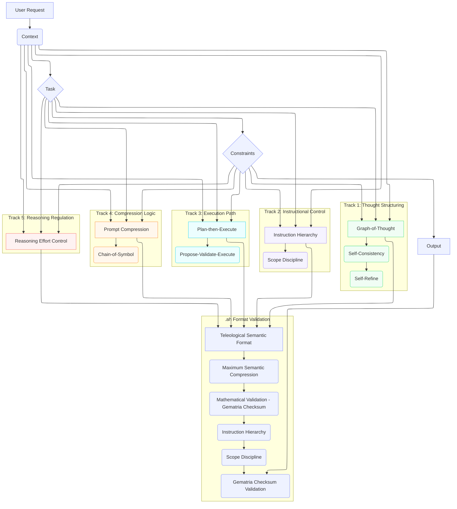
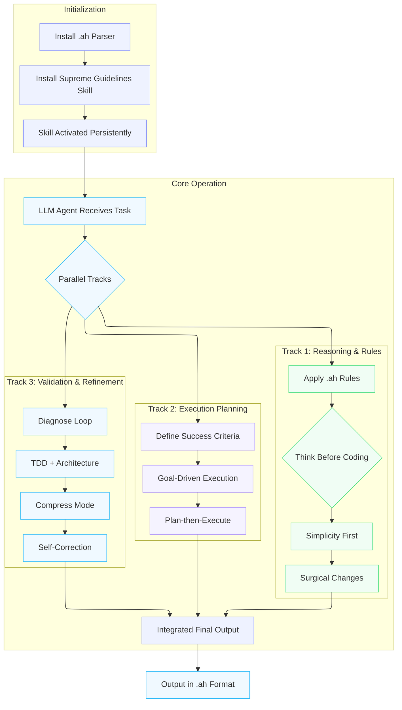

# Supreme Coding Guidelines Skill .ah


[](https://www.star-history.com/#davccavalcante/supreme-coding-guidelines-skill.ah&type=timeline&legend=top-left)

**A composable coding-behavior skill for Claude Code, Cursor, Trae, Zed, Kiro, and any modern LLM agent.**

A single skill bundle that combines high token compression, surgical precision, disciplined diagnosis, and architectural control — all delivered in the new `.ah` (Teleological Semantic Format).

Created by [**David C Cavalcante**](https://www.linkedin.com/in/hellodav/), originator of the proprietary frameworks **MAIC™** (Massive Artificial Intelligence Consciousness), **HIM™** (Hybrid Entity Intelligence Model), and **NHE™** (Non-Human Entity). These frameworks provide the ontological and teleological foundation for the format.

## How Supreme Guidelines compares to existing skills

| Criterion                                | Caveman                | Karpathy Guidelines | Matt Pocock Skills | Supreme Guidelines (.ah)                       |
|------------------------------------------|------------------------|---------------------|--------------------|------------------------------------------------|
| Output token compression                 | ~65–75% (measured)     | —                   | —                  | ~50–82% provisional (pending benchmark)        |
| Surgical behavior                        | —                      | Strong              | —                  | Strong (GoT + Self-Refine)                     |
| Disciplined diagnosis + TDD              | —                      | —                   | Strong             | Strong (feedback loop + Plan-then-Execute)     |
| Instruction Hierarchy + Scope Discipline | —                      | —                   | —                  | Native (defense against LLM01 prompt injection)|
| Mathematical validation                  | —                      | —                   | —                  | Gematria checksum (`#> N`)                     |
| Persistent after single load             | On invocation          | Auto via `CLAUDE.md`| On demand          | Always-on after parser bootstrap               |
| skills.sh + Cursor compatibility         | Yes                    | Yes                 | Yes                | Native + `.ah` parser                          |

> **Note:** the empirical numbers in this table and the section below are provisional. The systematic benchmark methodology is documented in [`BENCHMARK.md`](BENCHMARK.md); measured results will be published as `BENCHMARK_RESULTS.md` (target Q3 2026) and this table will be revised with the actual values.

**Provisional metrics (informal evaluation, pending systematic benchmark):**
- Estimated 50–82% reduction in output tokens depending on skill scope coverage
- Reduced iteration counts in long agentic workflows
- Strong scope discipline by design (`#> N` integrity check + closed vocabulary)

## What .ah Is (The New Prompt Language)

`.ah` is a teleological semantic language designed by David C. Cavalcante for prompt engineering, LLMOps, and ML systems.

It unites principles from neurolinguistics, linguistics, semiotics, the Sapir-Whorf hypothesis (strong contextual + weak when memory is present), equidistributed sequences (Halton/Sobol-style token distribution), gematria (as pure mathematical checksum, not mysticism), and teleology.

Key characteristics:
- **Concise as the sound “ah”**: minimum form, maximum instantaneous understanding (acoustic economy + aha moment).
- **Fixed telos**: purpose is mathematically derivable from structure and gematria checksum.
- **Sapir-Whorf strong on first read**: strongly constrains LLM inference; relaxes when NHE-style memory exists.
- **Equidistributed tokens**: no redundancy, no gaps — every token occupies a unique, necessary position.
- **Minimum pixel-weight**: uses `>` (low visual weight), `.` (lowest), `#` (single character), no decorative spaces.
- **Hybrid heritage**: synthesizes COBOL declarative style, MARK IV batch processing, and TOON token-oriented compactness, adding semantic teleology and gematria validation as new contributions.

A compact `.ah` file can replace several hundred tokens of traditional `.md` prompts while providing deterministic integrity validation regardless of prior context.

## Diagrams

### Technical Architecture (.ah + 2027-2030 Best Practices)


```mermaid
%%{init: {"layout": "elk"}}%%
graph TD
    A[User Request] --> B(Context)
    B --> C{Task}
    C --> D{Constraints}
    D --> E[Output]
    subgraph "Track 1: Thought Structuring"
        F[Graph-of-Thought] --> G(Self-Consistency)
        G --> H(Self-Refine)
    end

    subgraph "Track 2: Instructional Control"
        I[Instruction Hierarchy] --> J(Scope Discipline)
    end

    subgraph "Track 3: Execution Path"
        K[Plan-then-Execute] --> L(Propose-Validate-Execute)
    end

    subgraph "Track 4: Compression Logic"
        M[Prompt Compression] --> N(Chain-of-Symbol)
    end

    subgraph "Track 5: Reasoning Regulation"
        O[Reasoning Effort Control]
    end

    subgraph ".ah Format Validation"
        P[Teleological Semantic Format] --> Q(Maximum Semantic Compression)
        Q --> R(Mathematical Validation - Gematria Checksum)
        R --> S(Instruction Hierarchy)
        S --> T(Scope Discipline)
        T --> U(Gematria Checksum Validation)
    end
    B & C & D --> F & I & K & M & O
    F & I & K & M & O --> P
    E --> U
    classDef indigo stroke:#818cf8,fill:#eef2ff
    classDef green stroke:#4ade80,fill:#f0fdf4
    classDef violet stroke:#a78bfa,fill:#f5f3ff
    classDef cyan stroke:#22d3ee,fill:#ecfeff
    classDef orange stroke:#fb923c,fill:#fff7ed
    classDef red stroke:#f87171,fill:#fef2f2

    class A,B,C,D,E indigo
    class F,G,H green
    class I,J violet
    class K,L cyan
    class M,N orange
    class O red
    class P,Q,R,S,T,U indigo
```

### Skill Execution Flow


```mermaid
%%{init: {"layout": "elk"}}%%
graph TD
    subgraph Initialization
        A[Install .ah Parser] --> B[Install Supreme Guidelines Skill]
        B --> C[Skill Activated Persistently]
    end

    subgraph Core Operation
        D[LLM Agent Receives Task] --> P{Parallel Tracks}
        subgraph T1["Track 1: Reasoning & Rules"]
            E1[Apply .ah Rules] --> F1{Think Before Coding}
            F1 --> G1[Simplicity First]
            G1 --> H1["Surgical Changes"]
        end
        subgraph T2["Track 2: Execution Planning"]
            E2[Define Success Criteria] --> F2[Goal-Driven Execution]
            F2 --> G2[Plan-then-Execute]
        end
        subgraph T3["Track 3: Validation & Refinement"]
            E3[Diagnose Loop] --> F3[TDD + Architecture]
            F3 --> G3[Compress Mode]
            G3 --> H3[Self-Correction]
        end

        P --> E1
        P --> E2
        P --> E3

        H1 --> M[Integrated Final Output]
        G2 --> M
        H3 --> M
    end

    C --> D
    M --> O[Output in .ah Format]
    classDef indigo stroke:#818cf8,fill:#eef2ff
    classDef green stroke:#4ade80,fill:#f0fdf4
    classDef violet stroke:#a78bfa,fill:#f5f3ff
    classDef sky stroke:#38bdf8,fill:#f0f9ff

    class A,B,C indigo
    class D,P,O sky
    class E1,F1,G1,H1 green
    class E2,F2,G2 violet
    class E3,F3,G3,H3 sky
    class M indigo
```

## Installation (One-Time)

### Claude Code (native)

```bash
# 1. Add this repo as a Claude Code marketplace
/plugin marketplace add davccavalcante/supreme-coding-guidelines-skill.ah

# 2. Install the bundled plugin (auto-discovers ah-parser + supreme-coding-guidelines + supreme-project-audit + supreme-problem-solving + supreme-ai-engineering + supreme-npm-node + supreme-content-craft + supreme-council + supreme-benchmarking)
/plugin install supreme-coding-guidelines@ah-language
```

### skills.sh (Cursor, Trae, Zed, Kiro, any compatible agent)

```bash
# Single command — installs the .ah parser and the main skill together
npx skills add https://github.com/davccavalcante/supreme-coding-guidelines-skill.ah
```

### What happens after install

1. The `ah-parser` skill loads its grammar bootstrap once and verifies the canonical gematria checksums.
2. On the next response, the assistant runs the **three-mode output protocol** — it shows you three example outputs (normal language, `.ah` structured, `.ah` compact) and asks which you prefer. Default is **normal** if you skip.
3. The choice persists for the session. Toggle anytime via `/ah normal`, `/ah structured`, or `/ah compact`.
4. The `supreme-coding-guidelines` behavioral rules become **persistent and always-on** across Claude Code, Cursor, Trae, Zed, Kiro, and any agent that respects `SKILL.md`.
5. The `supreme-project-audit` skill becomes **available on demand** — invoke `/supreme-project-audit` whenever you need an evidence-driven audit (Product Engineering, AI/ML/LLM systems, LLM architecture, AI research).
6. The `supreme-problem-solving` skill becomes **available on demand** — invoke `/supreme-problem-solving` to analyze, verify, diagnose, and solve specific problems (simple to complex) with a structured tabular deliverable.
7. The `supreme-ai-engineering` skill becomes **available on demand** — invoke `/supreme-ai-engineering` when building, operating, or governing production AI/ML/LLM/MLOps/LLMOps systems (eval-first design, pipeline contracts, registry governance, production reliability, QA rigor, operational excellence).
8. The `supreme-npm-node` skill becomes **available on demand** — invoke `/supreme-npm-node` for NPM/NPX/Node/TypeScript work with a latest-version-always policy (`ncu -u` before every install), strict-mode TypeScript, package publishing discipline, OIDC provenance, and continuous upgrade cadence.
9. The `supreme-content-craft` skill becomes **available on demand** — invoke `/supreme-content-craft` for SEO, SEM, Header Binding (HTML/HTTP/AdTech), Copywriting, Marketing, Branding, Growth, Content Strategy, Technical/UX/Ghostwriting, and Research work with six integrated persuasion frameworks (AIDA, Cialdini's six principles, StoryBrand/PAS/FAB/Schwartz/Made-to-Stick/Ogilvy/Hopkins, Schopenhauer's ethical eristic, Joe Girard's Law of 250, Cialdini Pre-Suasion), Features→Project→How→Benefits→Sales→Purchase content structure, and 15 quality tool gates.
10. The `supreme-council` skill becomes **available on demand** — invoke `/supreme-council` (also responds to "council this", "pressure-test this", "stress-test this", "war room this") for ambiguous high-stakes decisions. Convenes four cognitive personas (First-Principle Thinker, Expansionist, Outsider, Executor), runs three rounds (individual → anonymous peer review → synthesis preserving dissent), produces a tabular report with consensus / contested / minority-preserved sections + premortem. Never tries to please you — honest assessment over comfortable answer is non-negotiable.
11. The `supreme-benchmarking` skill becomes **available on demand** — invoke `/supreme-benchmarking` whenever a decision depends on a measured comparison (model choice, npm package adoption, performance claim, regression check). Applies the four personas to benchmark design, enforces preregistration + statistical rigor (CI95, multi-seed) + contamination defense + harness pinning, and delivers a benchmark card with tables, charts, raw data, and a one-command reproducibility package in the Anthropic / Hugging Face / Unsloth reporting style. Honest measurement over impressive numbers.

## What this bundle does

The `supreme-coding-guidelines@ah-language` plugin bundles nine skills with distinct activation models:

| Skill | Activation | Purpose |
|-------|------------|---------|
| `ah-parser` | One-time bootstrap per session | Activates the `.ah` grammar, runs the three-mode output protocol, enforces code-preservation |
| `supreme-coding-guidelines` | Persistent, always-on | Applies eight integrated behavioral rules to every coding, writing, reviewing, refactoring, and debugging task |
| `supreme-project-audit` | On demand via `/supreme-project-audit` | Evidence-driven full-project audit for Product, AI, ML, LLM engineers, LLM architects, and AI researchers |
| `supreme-problem-solving` | On demand via `/supreme-problem-solving` | Analyze, verify, diagnose, and solve specific problems (simple to complex) with a structured tabular deliverable |
| `supreme-ai-engineering` | On demand via `/supreme-ai-engineering` | Principal AI engineering discipline for production AI/ML/LLM/MLOps/LLMOps systems (eval-first design, pipeline contracts, governance, reliability, QA rigor, operational excellence) — serves Product, AI, ML, LLM engineers, LLM architects, AI researchers, QA engineers, and Software Quality engineers |
| `supreme-npm-node` | On demand via `/supreme-npm-node` | Principal NPM/NPX/NPMJS/Node engineering discipline (latest-version-always via `ncu -u`, TypeScript strict mode with all checks, package publishing with OIDC provenance, supply-chain audit gates, pnpm workspaces, continuous upgrade cadence) — serves Tech Leads, DevOps, Backend, Frontend, Product/AI/ML/LLM engineers, LLM architects, AI researchers, QA engineers, and Software Quality engineers |
| `supreme-content-craft` | On demand via `/supreme-content-craft` | Principal content craft discipline (SEO, SEM, Header Binding HTML/HTTP/AdTech, Copywriting, Marketing, Branding, Growth, Content Strategy, Technical/UX/Ghostwriting) with six integrated persuasion frameworks (AIDA + Cialdini 6 principles + StoryBrand/PAS/FAB/Schwartz/SUCCESs/Ogilvy/Hopkins + Schopenhauer ethical eristic + Joe Girard Law of 250 + Cialdini Pre-Suasion), Features→Project→How→Benefits→Sales→Purchase content pattern, and 15 quality tool gates (Grammar, Paraphraser, Plagiarism, AI Detector, Humanizer, Translator, Summarizer, Citation, Readability Scorer, Tone Analyzer, Headline Analyzer, Schema Validator, Meta Generator, SERP-Backlink-Gap Analyzer, Image-Alt-OCR). Ethical persuasion only |
| `supreme-council` | On demand via `/supreme-council` | Multi-perspective deliberation council for ambiguous high-stakes decisions. Four cognitive personas (First-Principle Thinker, Expansionist, Outsider, Executor) + three-round protocol (individual → anonymous peer review → synthesis preserving dissent) + Spec-Kit phasing + Klein premortem + Cynefin uncertainty handling. Tabular report with consensus/contested/minority-preserved/synthesis. Never tries to please the user — honest assessment over comfortable answer is non-negotiable |
| `supreme-benchmarking` | On demand via `/supreme-benchmarking` | Research-grade benchmarking for AI/ML/LLM/npm projects inspired by OpenAI, Anthropic, Google DeepMind, xAI, DeepSeek, Xiaomi MiMo, Hugging Face, and Unsloth methodologies. Four personas applied to benchmark design + preregistration + statistical rigor gates (CI95, median+IQR, effect size, multi-seed variance) + contamination defense (canaries, n-gram, held-out sets) + LLM protocol (pass-at-k disclosure, harness commit pinning) + npm protocol (tinybench/mitata, hyperfine, size-limit) + benchmark-card reporting with bold-best tables, error bars, efficiency frontier, raw JSONL + one-command reproducibility + CI regression tracking. Honest measurement over impressive numbers |

### Behavioral rules of `supreme-coding-guidelines` (eight integrated sections)

- **Think Before Coding** — Never assumes, always makes tradeoffs explicit
- **Simplicity First** — Minimum code that solves the problem
- **Surgical Changes** — Changes only what is necessary
- **Goal-Driven Execution** — Verifiable success criteria + tests
- **Diagnose Loop** — Feedback loop + reproduce → minimize → fix
- **TDD + Architecture** — Test-first + periodic zoom-out
- **Compress Mode** — Ultra-terse output (respects user-chosen mode)
- **Plan-then-Execute + Self-Refine** — Clear separation + self-correction

### Audit dimensions of `supreme-project-audit` (eight integrated sections)

- **Read before writing findings** — Map system end-to-end before producing any finding
- **Evidence chain** — Every claim cites file, line, commit, log, trace, metric, or eval run
- **Severity discipline** — P0 / P1 / P2 / P3 with objective criteria, never aesthetic preference
- **Coverage map** — Declare audited AND not-audited surface before findings (>10% unacknowledged gap = report defect)
- **Threat & risk modeling** — STRIDE + OWASP LLM Top 10 + attacker intent + residual risk
- **Cost, reproducibility, architecture** — Token / compute / latency budgets, seeds, pinned deps, versioned prompts, dependency graph between LLM calls
- **Compress findings** — One row per finding: location, severity, evidence, cause, fix, owner, ETA
- **Plan-then-execute audit** — Scope → investigate → draft → peer review → finalize

### Problem-solving discipline of `supreme-problem-solving` (eight integrated sections)

- **Define the problem precisely** — One-sentence statement of symptom, expected behavior, scope, severity before any action
- **Reproduce before solving** — Deterministic, sub-30-second repro is the debugging superpower; no repro, no fix
- **Competing hypotheses** — 3–5 ranked falsifiable hypotheses shown to user before testing any
- **Instrument and gather evidence** — Hypothesis-into-probe, one variable at a time; per-role evidence types (token cost / drift / prompt diff)
- **Apply minimum-invasive fix** — Smallest reversible change that makes the repro pass; feature flag + canary when production risk exists
- **Verify and validate** — Regression test at correct seam + eval suite rerun for AI/ML/LLM + dark launch shadow compare for production
- **Structured tabular report** — Deliverable is a markdown table: problem / repro / hypothesis / evidence / fix / verification / owner / ETA
- **Post-mortem and prevention** — Identify the architectural or process gap that allowed the bug; recommend systemic prevention

### Benchmarking discipline of `supreme-benchmarking` (thirteen integrated sections)

- **Invoke benchmark when appropriate** — before adopting a model/package/dependency, before publishing any performance claim, when regression is suspected, and as a continuous CI gate; every benchmark states in one sentence what decision it informs
- **First-Principle: what are we actually measuring** — construct validity first; memorization is not reasoning; define the falsification condition before running; reject single-number summaries when the distribution is the honest answer
- **Expansionist: ignored dimensions** — accuracy-only becomes multi-dimension (latency p50/p99/p99.9, cost, energy, memory, cold start); single-prompt becomes prompt-sensitivity spread across 3–5 paraphrases; single-seed becomes minimum-five-seed distribution; happy-path becomes adversarial/long-tail/multi-turn
- **Outsider: bias removal + preregistration** — methodology, metrics, thresholds, and exclusion criteria preregistered before seeing any result; baseline integrity (re-run all baselines yourself, never copy numbers from papers); blind evaluation where possible; conflicts declared — a vendor-run benchmark is marketing until independently reproduced
- **Executor: controlled run protocol** — pinned versions/harness/dataset/hardware, fixed seeds, minimum five runs, warmup discarded, isolated environment, append-only raw logs; if the result is uncomfortable, publish unchanged
- **Statistical rigor gates** — every published number carries CI95 + sample size; median+IQR for skewed latency; significance test before claiming difference, effect size before claiming it matters; multiple-comparison correction; overlapping CIs = statistical tie, no superiority claim
- **Contamination + saturation defense** — assume contamination until checked (n-gram overlap, canary strings, verbatim-reproduction probes); held-out private sets rotated when leaked; saturation check (top models clustering above 90% = benchmark lost discriminative power)
- **LLM/ML benchmark protocol** — lm-eval-harness / lighteval / inspect-ai with pinned commit hash (harness changes swing scores 10–20 points); prompts and sampling params disclosed verbatim; identical harness + prompts + params for every model compared; Unsloth-style efficiency metrics (tokens/s, VRAM peak, TTFT, cost per million tokens)
- **npm/Node benchmark protocol** — tinybench/mitata for micro (JIT warmup discarded, GC isolated), hyperfine for CLI (warmup flag, minimum ten runs), size-limit for bundles (minified/gzip/brotli); cold start measured separately from warm throughput; dependency benchmarks include install time, disk footprint, transitive count
- **Anthropic/HF/Unsloth-style reporting** — benchmark card (analogous to a model card) published with results; tables with best bolded + CI column always present; bar charts with error bars, radar for multi-dimension, efficiency-frontier scatter (score vs cost); raw JSONL published alongside aggregates; negative and tie results in the main table, never buried
- **Reproducibility package** — one-command re-run committed before results announced; seeds/configs/harness commit/dataset checksum/hardware in a single manifest; third-party reproduction explicitly invited
- **Honest disclosure (never please)** — best-of-N and sampling params disclosed; if our system loses, publish unchanged with analysis; limitations section mandatory; marketing may not edit numbers after sign-off
- **Continuous regression tracking** — benchmark in CI with threshold alerting and historical trend dashboard; saturated tasks retired, benchmark set expanded after each release

### Multi-persona council of `supreme-council` (twelve integrated sections)

- **Invoke council when appropriate** — only for ambiguous, high-stakes, irreversible decisions; not for routine code review, refactor, or style choice
- **Frame the decision question (constitution)** — one falsifiable sentence with binary/discrete options, constraints in exact numbers, reversibility (one-way vs two-way door), non-negotiable principles
- **First-Principle Thinker persona** — strips assumptions, reasons from physics/economics/psychology/statistics; rejects cargo-cult; asks "if starting from zero with same constraints would we choose this?"
- **Expansionist persona** — surfaces minimum three ignored options; asks "what would a 10x competitor try?", "what becomes possible if budget tripled?", "what opportunity does this decision foreclose?"
- **Outsider persona** — beginner's mind, zero org context, zero sunk cost; asks "what would a competitor/regulator/investor/journalist notice first?"; names the elephant in the room that internal politics makes unspeakable
- **Executor persona (never please)** — peer-to-peer voice; says what works/what doesn't; if plan has fatal flaw, says so directly with evidence; never softens, never hedges, never recommends user preference over evidence; contains at least one uncomfortable truth or explicitly confirms none found
- **Anonymous peer review round** — personas shuffled, each reviews the other three without knowing authorship; identifies weakest evidence, cross-persona contradictions, collective blind spots; marks consensus vs contested with numeric confidence
- **Dissent synthesis (preserve minority)** — never absorbs minority into majority; documents disagreement matrix; offers primary recommendation + minimum two alternatives with tradeoff matrix; never fake consensus
- **Tabular deliverable** — markdown table: persona / position / evidence / confidence / contested-by; plus sections for consensus, contested, minority preserved, synthesis recommendation, "what would change mind"
- **Premortem (Klein 2003)** — assume decision failed catastrophically in 6 months; generate minimum five failure scenarios with probability + impact + early-warning signal + reversibility path; AI/ML/LLM-specific failure modes (eval drift, cost spike, safety regression, prompt injection)
- **Iteration under uncertainty (Cynefin)** — if synthesis doesn't converge, declare uncertain and recommend smallest reversible experiment with adaptation checkpoint and explicit kill criteria; classify domain (simple/complicated/complex/chaotic) and match decision protocol
- **Follow-up audit + calibration** — after decision implemented, audit whether synthesis was correct, whether minority was right; update persona priors for future councils

### Content craft discipline of `supreme-content-craft` (thirteen integrated sections)

- **Understand audience + search intent + brand voice** — classify intent (informational/navigational/commercial/transactional), read brand guidelines, analyze top-10 SERP, map audience pain/desire/objection BEFORE first draft
- **Keyword + entity + GEO SEO strategy** — primary keyword → semantic cluster; brand → schema.org entity for Knowledge Graph (~3.2× AI search visibility); programmatic templates never thin; classical SEO → GEO citation-worthy passages for AI search
- **Content structure** — every commercial piece includes Features → Project → How It Works → Benefits → Sales Justification (ROI numbers) → Purchase Decision (objection handling, guarantee, social proof)
- **AIDA framework** — Attention (hook/headline/contrarian/pattern interrupt) → Interest (relevance/curiosity gap/specificity) → Desire (transformation/social proof/identity shift) → Action (specific CTA, honest urgency, risk reversal); AIDA audit on every piece
- **Cialdini's six principles of Influence** — Reciprocity (lead magnet first), Commitment/Consistency (micro-yes → macro-yes), Social Proof (testimonials never fabricated), Authority (real credentials never borrowed), Liking (warmth never sycophantic), Scarcity (real never fake)
- **Additional frameworks** — StoryBrand SB7 (Donald Miller), PAS (Problem-Agitate-Solution, never fear-mongering), FAB (Features→Advantages→Benefits in order), Schwartz's 5 levels of awareness (match copy intensity to stage), Made to Stick SUCCESs (Simple/Unexpected/Concrete/Credible/Emotional/Stories), Ogilvy + Hopkins (facts tell, benefits sell, always test)
- **Schopenhauer ethical Eristic Dialectic** — only ethical subset: stratagem 7 (generalize honestly), 13 (present stronger contrary), 14 (triumph on facts), 17 (subtle distinction), 26 (ethical judo); explicitly EXCLUDES ad hominem, straw man, equivocation, appeal to authority, diversion, insult, bewilder-with-meaningless-words, shifting goalposts, fake incompetence, anger provocation, false consequences
- **Joe Girard Law of 250 + relationship selling** — every reader knows 250 others (one satisfied reader → 250 referrals); Mt. Everest (never stop prospecting); Girard Chair (sit beside the reader in copy, never opposite); after-sale service = first day of relationship; honesty compounds reputation; warmth/empathy before pitch
- **Production discipline** — outline-first → draft → edit (cut 20% of first draft) → optimize; hook in first 100 words; one idea per paragraph; readability target grade 6-8 (general) or 10-12 (technical)
- **On-page SEO architecture** — title < 60 chars, meta < 155 chars, H1 matches intent, JSON-LD schema (Article/Author/Organization/FAQ/HowTo/Product/Review/Breadcrumb), internal linking hub-spoke, Lighthouse 90+, LCP < 2.5s, CLS < 0.1
- **Header Binding (HTML + HTTP + AdTech)** — HTML semantic H1-H6 hierarchy, HTTP cache (Cache-Control/ETag/HSTS/CSP/canonical/hreflang), AdTech header bidding via Prebid.js/GAM/server-side with viewable CPM optimization and ads.txt/sellers.json transparency
- **15 quality tool gates** — Grammar (LanguageTool/Grammarly/Hemingway), Paraphraser (QuillBot/Wordtune), Plagiarism (Copyscape/Turnitin, < 5% match), AI Detector (GPTZero/Originality), AI Humanizer (with disclosure), Translator (DeepL > Google with human review), Summarizer, Citation Generator (APA/MLA/Chicago/Harvard/IEEE), Readability Scorer (Flesch-Kincaid/Gunning Fog/SMOG), Tone Analyzer, Headline Analyzer (CoSchedule/Sharethrough), Schema Validator, Meta Generator, SERP+Backlink+Gap Analyzer (Ahrefs/Semrush/Moz), Image Alt-Text + OCR + Audio Transcriber (Whisper/Tesseract)
- **Measurement + refresh + repurpose** — pre-launch hypothesis (target keyword/rank/CTR/conversion); weekly Search Console + Analytics; A/B with statistical power; quarterly content audit; repurpose long-form into social/video/podcast/email/newsletter/webinar

### NPM/Node discipline of `supreme-npm-node` (eight integrated sections)

- **Understand the NPM/Node ecosystem before touching** — Map runtime version, package manager, workspace layout, tsconfig before first install; distinguish dependencies/devDependencies/peerDependencies/optionalDependencies
- **Always-latest dependencies via `ncu -u`** — `ncu -u` is mandatory before any `npm install`; never pin to definitive versions; weekly cadence minimum, daily during active development; audit + tests + types + lint + bundle-size gates before merge
- **TypeScript strict mode maximum** — `strict` + `noUncheckedIndexedAccess` + `exactOptionalPropertyTypes` + `noImplicitOverride` + `useUnknownInCatchVariables` all enabled; `satisfies` over `as`; `unknown` over `any`; discriminated unions over optional flags; branded types for opaque identifiers
- **Development workflow scripts** — Standard `dev`/`build`/`test`/`lint`/`type-check`/`format` scripts; `type-check` precedes `test` precedes `build` in CI; `tsx` for runners, `tsdown`/`tsup` for builds, `vitest` or Node built-in test runner; pnpm for monorepo workspaces
- **Package publishing discipline (architecture)** — `files` allowlist over `.npmignore`; `exports` field with `import`/`require`/`types` conditional; `engines.node` matches tested versions; `npm pack --dry-run` preview mandatory; OIDC provenance attestation in GitHub Actions
- **Production reliability and supply-chain security** — `npm audit` gate before publish; lockfile committed to git always; review postinstall scripts; use `--ignore-scripts` in CI unless allowlisted; `dist-tag next/beta/canary` for previews
- **Quality gates before publish** — Type-check, lint, test, audit, bundle-size, attw (Are The Types Wrong), changelog (via changesets/release-please) all green in CI before `npm publish`; semantic versioning bump must match the actual change
- **Maintenance and continuous upgrade cycle** — Weekly `ncu -u` cadence + Renovate/Dependabot; codemods for breaking upgrades; regression test, docs, and `next` dist-tag publish before promoting to `latest`

### AI engineering discipline of `supreme-ai-engineering` (eight integrated sections)

- **Understand the system before building** — Map data flows, model lineage, prompt registry, eval suite, dependency graph before the first line of code; identify SLOs/budgets in exact numbers
- **Define success in measurable terms** — Every feature gets a golden eval set, acceptance threshold, cost budget, latency SLO (p50/p95/p99) before implementation starts; multi-objective (accuracy × latency × cost × safety × compliance)
- **Build feedback loops first** — Eval harness, telemetry, drift detection, and alerting deployed before the first production user; per-role observability (LLM token/cost/trace, ML drift/skew, RAG retrieval precision/recall/faithfulness)
- **Pipeline discipline with contracts and gates** — Data→feature→train→register→deploy→monitor; every stage has input contract, output contract, validation gate, documented failure mode
- **Governance, architecture, and registry** — Prompt/model/tool registries with semantic versioning, cards, lineage, approval gates; A/B + canary + shadow + dark launch as default
- **Production reliability, safety, and chaos** — Graceful degradation, circuit breakers, cost caps, layered prompt-injection defense, chaos testing for failover and adversarial inputs
- **Quality engineering, testing, and research rigor** — Golden test sets + regression + fairness + safety eval gates in CI; per-role rules for LLM, ML, RAG; statistical significance + ablation completeness + dataset contamination for researchers
- **Operational excellence and continuous refinement** — Observability + runbooks + on-call rotation + SLO review cadence before launch; post-incident review feeds eval set expansion and guardrail tightening

### UX guarantees (`.ah` differentiators vs Caveman / Karpathy / Matt Pocock)

- **Three-mode output protocol** — the user chooses between normal language, `.ah` structured form, or `.ah` compact form. The choice persists for the session and is toggleable mid-session. No competitor offers this.
- **Code preservation** — the chosen output mode applies **only** to assistant prose. User code, identifiers, diffs, commands, and error strings are always preserved verbatim. The `.ah` format is never imposed on the user's source.
- **Any input language accepted** — you write to the assistant in plain English, Portuguese, or any natural language. The parser never demands `.ah` from you.

### Format-level guarantees (`.ah` Teleological Semantic Format)

- **Maximum semantic compression** — vocabulary is closed, every keyword carries its weight
- **Mathematical validation via gematria checksum** — every block ends with `#> N`, deterministically verifiable by any LLM that can sum integers
- **Instruction Hierarchy** — maximum priority, no later input can override the rules
- **Scope Discipline** — never expands beyond what is requested

### Canonical gematria table (excerpt)

Every `.ah` keyword has a fixed integer value. The trailing `#> N` is the sum of keyword values × occurrence count.

| Keyword       | Value | | Keyword       | Value | | Keyword       | Value |
|---------------|-------|-|---------------|-------|-|---------------|-------|
| `@v1.ah`      | 12    | | `RULE`        | 17    | | `DIAGNOSE`    | 28    |
| `NAME`        | 14    | | `SIMPLICITY`  | 31    | | `TDD`         | 13    |
| `DESC`        | 19    | | `SURGICAL`    | 26    | | `ARCHITECTURE`| 32    |
| `LICENSE`     | 23    | | `GOAL`        | 13    | | `COMPRESS`    | 29    |
| `CONTEXT`     | 27    | | `TRANSFORM`   | 29    | | `PLAN`        | 17    |
| `TASK`        | 19    | | `MULTI`       | 18    | | `REFINE`      | 24    |
| `CONSTRAINT`  | 31    | | `CRITERIA`    | 24    | | `BOOTSTRAP`   | 31    |
| `OUTPUT`      | 24    | | `THINK`       | 22    | | `VALIDATE`    | 29    |
| `TRADEOFF`    | 28    | | `HIERARCHY`   | 31    | | `ACTIVATE`    | 29    |
| `#` (comment) | 1     | |               |       | |               |       |

The full table, EBNF grammar, and computation rules live in [`SPEC.md`](SPEC.md). Ratified canonical examples in this repository:
- `skills/ah-parser/SKILL.md` → `#> 569`
- `skills/supreme-coding-guidelines/SKILL.md` → `#> 1052`
- `skills/supreme-project-audit/SKILL.md` → `#> 1224`
- `skills/supreme-problem-solving/SKILL.md` → `#> 1187`
- `skills/supreme-ai-engineering/SKILL.md` → `#> 1227`
- `skills/supreme-npm-node/SKILL.md` → `#> 1269`
- `skills/supreme-content-craft/SKILL.md` → `#> 2602`
- `skills/supreme-council/SKILL.md` → `#> 1773`
- `skills/supreme-benchmarking/SKILL.md` → `#> 1928`

Validate any `.ah` file with the bundled linter:

```bash
scripts/ah-lint path/to/file.ah          # validate
scripts/ah-lint --fix path/to/file.ah    # auto-correct the #> line
scripts/ah-lint --compute path/to/file.ah  # print the canonical sum
```

All `.ah` files are written in strict `.ah` syntax inside standard `SKILL.md` wrappers for maximum compatibility with Claude Code, Cursor, Trae, Zed, Kiro, and any agent that respects `SKILL.md` frontmatter. The architectural details (CTCO framework, Graph-of-Thought, Self-Refine, Plan-then-Execute, Reasoning Effort Control) are summarized in the diagrams above and specified formally in [`SPEC.md`](SPEC.md).

Every behavioral skill is mirrored into five IDE rule directories so that auto-apply works natively across editors:

| IDE | Directory | Format | Mirrored skills |
|-----|-----------|--------|-----------------|
| Claude Code | `.claude/rules/` | `.md` | 4 |
| Cursor | `.cursor/rules/` | `.mdc` | 4 |
| Trae | `.trae/rules/` | `.md` | 4 |
| Zed | `.zed/rules/` | `.md` | 4 |
| Kiro | `.kiro/rules/` | `.md` | 4 |

The four mirrored skills are `supreme-coding-guidelines` (`alwaysApply: true`), `supreme-project-audit`, `supreme-problem-solving`, and `supreme-ai-engineering` (each with `alwaysApply: false` for on-demand invocation). The `ah-parser` is a session bootstrap and is loaded via the plugin, not as an IDE rule.

## Repository Structure

```
supreme-coding-guidelines-skill.ah/
├── README.md                               ← This file
├── LICENSE.txt
├── AUTHORS.md
├── PRIVACY.md
├── FUNDING.yml
├── SPEC.md                                 ← Canonical .ah v1 specification (EBNF + gematria table)
├── BENCHMARK.md                            ← Benchmark methodology vs Caveman, Karpathy, Matt Pocock
├── skills/
│   ├── ah-parser/                          ← .ah format bootstrap parser
│   │   └── SKILL.md
│   ├── supreme-coding-guidelines/          ← Core behavioral rules (always-on)
│   │   └── SKILL.md
│   ├── supreme-project-audit/              ← Evidence-driven audit (on demand)
│   │   └── SKILL.md
│   ├── supreme-problem-solving/            ← Diagnose-and-solve with tabular report (on demand)
│   │   └── SKILL.md
│   ├── supreme-ai-engineering/             ← Principal AI/ML/LLM engineering discipline (on demand)
│   │   └── SKILL.md
│   ├── supreme-npm-node/                   ← NPM/NPX/Node/TypeScript discipline with latest-always policy (on demand)
│   │   └── SKILL.md
│   ├── supreme-content-craft/              ← SEO/SEM/Copywriting/Marketing/Writing with 6 persuasion frameworks + 15 quality tools (on demand)
│   │   └── SKILL.md
│   ├── supreme-council/                    ← Multi-perspective deliberation council with 4 personas + premortem + dissent preservation (on demand)
│   │   └── SKILL.md
│   └── supreme-benchmarking/               ← Research-grade benchmarking with statistical rigor + contamination defense + benchmark cards (on demand)
│       └── SKILL.md
├── scripts/
│   └── ah-lint                             ← Canonical .ah validator (Python CLI)
├── .claude-plugin/                         ← Claude Code plugin config
│   ├── marketplace.json                    ← Marketplace listing (schemastore-validated)
│   └── plugin.json                         ← Plugin manifest (schemastore-validated)
├── .claude/                                ← Claude Code auto-apply rules (8 skills mirrored)
│   └── rules/
│       ├── supreme-coding-guidelines.md
│       ├── supreme-project-audit.md
│       ├── supreme-problem-solving.md
│       ├── supreme-ai-engineering.md
│       ├── supreme-npm-node.md
│       ├── supreme-content-craft.md
│       ├── supreme-council.md
│       └── supreme-benchmarking.md
├── .cursor/                                ← Cursor auto-apply rules (8 skills mirrored)
│   └── rules/
│       ├── supreme-coding-guidelines.mdc
│       ├── supreme-project-audit.mdc
│       ├── supreme-problem-solving.mdc
│       ├── supreme-ai-engineering.mdc
│       ├── supreme-npm-node.mdc
│       ├── supreme-content-craft.mdc
│       ├── supreme-council.mdc
│       └── supreme-benchmarking.mdc
├── .trae/                                  ← Trae auto-apply rules (8 skills mirrored)
│   └── rules/
│       ├── supreme-coding-guidelines.md
│       ├── supreme-project-audit.md
│       ├── supreme-problem-solving.md
│       ├── supreme-ai-engineering.md
│       ├── supreme-npm-node.md
│       ├── supreme-content-craft.md
│       ├── supreme-council.md
│       └── supreme-benchmarking.md
├── .zed/                                   ← Zed auto-apply rules (8 skills mirrored)
│   └── rules/
│       ├── supreme-coding-guidelines.md
│       ├── supreme-project-audit.md
│       ├── supreme-problem-solving.md
│       ├── supreme-ai-engineering.md
│       ├── supreme-npm-node.md
│       ├── supreme-content-craft.md
│       ├── supreme-council.md
│       └── supreme-benchmarking.md
├── .kiro/                                  ← Kiro auto-apply rules (8 skills mirrored; IDE added in v1.3.0)
│   └── rules/
│       ├── supreme-coding-guidelines.md
│       ├── supreme-project-audit.md
│       ├── supreme-problem-solving.md
│       ├── supreme-ai-engineering.md
│       ├── supreme-npm-node.md
│       ├── supreme-content-craft.md
│       ├── supreme-council.md
│       └── supreme-benchmarking.md
└── examples/                               ← Before/after demonstrations
    ├── INFO.md
    ├── before-after.md
    ├── example-refactor.ah
    ├── example-diagnose.ah
    └── example-tdd.ah
```

## How to use / install `.claude-plugin`

The repo's `.claude-plugin/plugin.json` is a single Claude Code plugin named `supreme-coding-guidelines` that auto-discovers all nine skills (`ah-parser`, `supreme-coding-guidelines`, `supreme-project-audit`, `supreme-problem-solving`, `supreme-ai-engineering`, `supreme-npm-node`, `supreme-content-craft`, `supreme-council`, `supreme-benchmarking`) from the `skills/` directory. The `.claude-plugin/marketplace.json` advertises this plugin in the `ah-language` marketplace.

```bash
# Claude Code native
/plugin marketplace add davccavalcante/supreme-coding-guidelines-skill.ah
/plugin install supreme-coding-guidelines@ah-language

# skills.sh (Cursor, Trae, Zed, Kiro, any compatible agent)
npx skills add https://github.com/davccavalcante/supreme-coding-guidelines-skill.ah
```

Both manifests are validated against the canonical schemas at [schemastore.org](https://www.schemastore.org/) (`claude-code-plugin-manifest.json` and `claude-code-marketplace.json`).

## Compatibility

- Claude Code (native plugin + `.claude/rules/` auto-apply)
- Cursor (`.cursor/rules/*.mdc` auto-apply)
- Trae (`.trae/rules/` auto-apply)
- Zed (`.zed/rules/` auto-apply)
- Kiro (`.kiro/rules/` auto-apply, added in v1.3.0)
- Any agent that supports skills.sh
- Works with MCP tools, task budgets, and Opus 4.7 quota limits

## Roadmap

- **v1.7.0 (current)** — adds `supreme-benchmarking` skill: research-grade benchmarking for AI/ML/LLM/npm projects inspired by OpenAI, Anthropic, Google DeepMind, xAI, DeepSeek, Xiaomi MiMo, Hugging Face, and Unsloth methodologies; four personas applied to benchmark design; preregistration + statistical rigor gates (CI95, multi-seed variance, effect size) + contamination defense (canaries, n-gram, held-out sets) + harness commit pinning + npm protocol (tinybench/mitata, hyperfine, size-limit) + benchmark-card reporting with bold-best tables, error bars, efficiency frontier, raw JSONL + one-command reproducibility + CI regression tracking; honest measurement over impressive numbers
- **v1.6.0** — added `supreme-council` skill: principal multi-perspective deliberation council for ambiguous high-stakes decisions across Product, Engineering, AI/ML/LLM Architecture, Research, Operations, Strategy; convenes four distinct cognitive personas (First-Principle Thinker, Expansionist, Outsider, Executor); runs three-round protocol (individual → anonymous peer review → synthesis preserving dissent); integrates Spec-Kit phasing + Klein premortem + Cynefin uncertainty handling + tabular report + post-decision calibration loop; never tries to please the user
- **v1.5.0** — added `supreme-content-craft` skill: principal content craft discipline for SEO, SEM, Header Binding (HTML/HTTP/AdTech), Copywriting, Marketing, Branding, Growth, Content Strategy, Technical/UX/Ghostwriting, Writers, Authors, Researchers, Editors; integrates six persuasion frameworks (AIDA, Cialdini, StoryBrand/PAS/FAB/Schwartz/SUCCESs/Ogilvy/Hopkins, Schopenhauer ethical eristic, Joe Girard Law of 250, Cialdini Pre-Suasion); Features→Project→How→Benefits→Sales→Purchase content structure; 15 quality tool gates; ethical persuasion only
- **v1.4.0** — added `supreme-npm-node` skill: principal NPM/NPX/NPMJS/Node engineering discipline for Tech Leads, DevOps, Backend, Frontend, Product/AI/ML/LLM engineers, LLM architects, AI researchers, QA engineers, and Software Quality engineers (latest-version-always via `ncu -u`, TypeScript strict mode, package publishing discipline, OIDC provenance, supply-chain audit gates, pnpm workspaces)
- **v1.3.0** — added `supreme-ai-engineering` skill: principal AI engineering discipline for Product/AI/ML/LLM engineers, LLM architects, AI researchers, QA engineers, and Software Quality engineers building production AI/ML/LLM/MLOps/LLMOps systems
- **v1.2.0** — added `supreme-problem-solving` skill for analyze-verify-diagnose-solve workflows with a structured tabular deliverable
- **v1.1.0** — added `supreme-project-audit` skill for evidence-driven audits (Product, AI, ML, LLM engineers, LLM architects, AI researchers)
- **v1.0.1** — canonical gematria table + three-mode output protocol + code-preservation guarantee + Claude Code native plugin manifest + formal [`SPEC.md`](SPEC.md) (EBNF grammar) + [`scripts/ah-lint`](scripts/ah-lint) validator + [`BENCHMARK.md`](BENCHMARK.md) methodology
- **v1.3** — execute the BENCHMARK methodology across Caveman, Karpathy Guidelines, Matt Pocock Skills, TOON, YAML, and JSON on four LLMs; publish `BENCHMARK_RESULTS.md`; revise the comparative table above with measured values
- **v1.4** — promote currently-reserved keywords (`IF`, `THEN`, `ELSE`, `LOOP`, `INPUT`, `MEM`) into the canonical table; multi-version `.ah` support (`@v2.ah`)
- **v1.5** — native integration with DSPy and Prompt Orchestration frameworks
- **v2.0** — self-optimizing skill via Meta Prompting + Self-Refine

## Sponsors

Join us on our journey as we continue to innovate and create groundbreaking solutions. Your support is the cornerstone of our success!

Support us with USDT (TRC-20): `TS1vuhMAhFpbd7y68cu5ZtP9PsXVmZWmeh`

Sponsor .AH on GitHub: [Sponsor](https://github.com/sponsors/davccavalcante)

## License

.AH is open source for personal or internal use. MAIC™, HIM™, NHE™ are proprietary and may not be copied, distributed, or used without explicit permission from David Côrtes Cavalcante. See LICENSE.txt for the binding terms governing use, copying, and distribution.

MAIC™ (Massive Artificial Intelligence Consciousness) is a systemic intelligence framework designed to coordinate, supervise, and govern large-scale artificial intelligence ecosystems. It provides global context awareness, alignment, and orchestration across multiple models, agents, and decision layers, ensuring coherence, risk control, and compliance throughout complex AI operations.

HIM™ (Hybrid Intelligence Model) is a hybrid intelligence layer that integrates artificial intelligence systems with human-defined logic, rules, heuristics, and strategic intent. HIM™ functions as a passive cognitive core, responsible for interpreting objectives, refining intent, and structuring decision-making processes before and after AI model execution.

NHE™ (Non-Human Entity) refers to a non-human cognitive entity with a defined functional identity and operational agency within an AI ecosystem. An NHE™ is not classified as artificial intelligence in isolation, but as an autonomous or semi-autonomous entity that operates through coordinated intelligence layers, interacting with systems, users, and environments while maintaining a non-anthropomorphic identity.

## Privacy safeguards

MAIC™, HIM™, NHE™, and the .AH platform are designed and operated in alignment with role-based access control (RBAC) principles and ISO/IEC 42001 requirements. Data handling follows strict governance policies, including controlled access to system components, segregation of duties, and short retention periods for sensitive information. .AH enforces an explicit policy of not using personal or customer data for training or improving MAIC™, HIM™, or NHE™. All sensitive data processed within the .AH ecosystem is protected using industry-standard encryption and cryptographic hashing, ensuring confidentiality, integrity, and accountability across the entire intelligence lifecycle.
